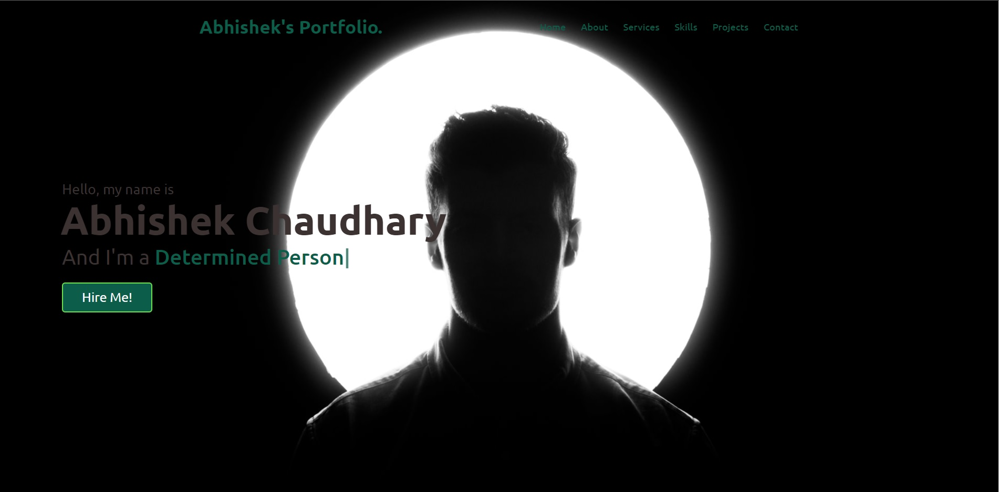
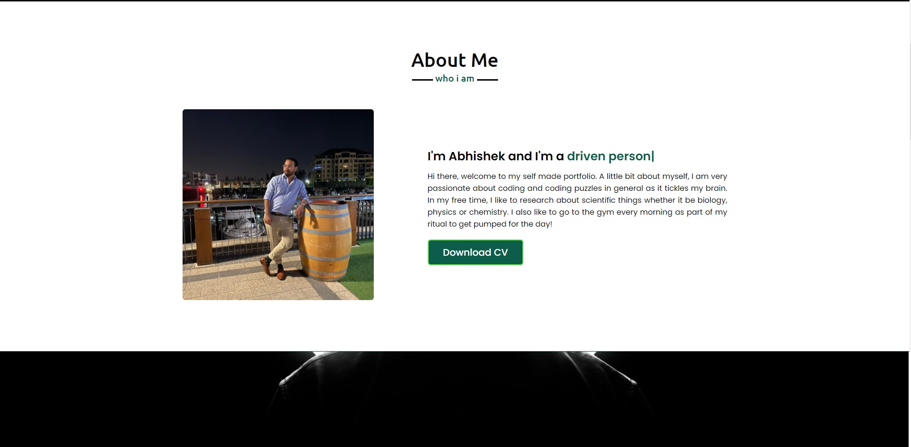
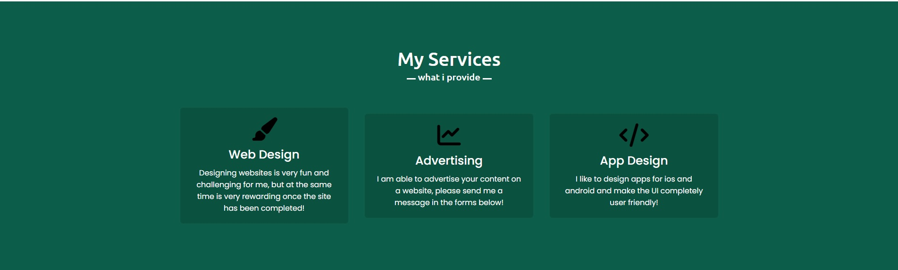
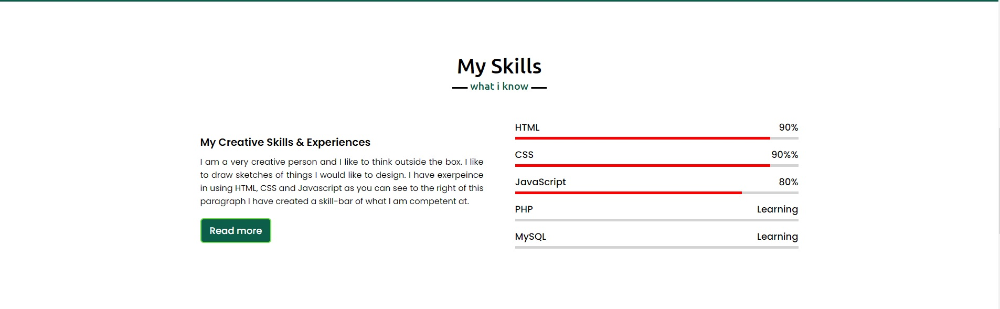
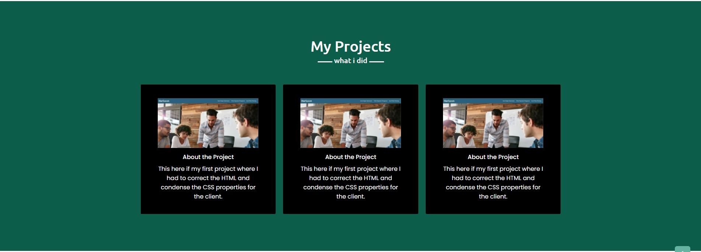
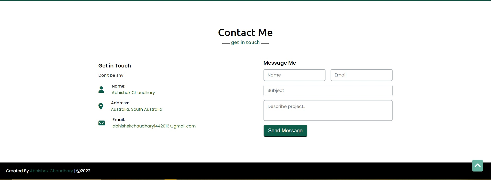

# Advance-CSS-Portfolio

##  Website URL
https://abhi20220.github.io/Advance-CSS-Portfolio/

## Goals
I built this project because the client wants to view
a potential employees deployed portfolio of work examples. 
So that they are able to review their work.

In addition to the clients request, I have developed a portfolio
for said employee with multiple section that highlight the potential employees skills.

## Problems and Solutions
There were a lot of bugs and problems that were encountered within the structure of the HTML framework as a result affected the CSS. For example a class was mislabeled and as a result the CSS would not be able to function correctly. 

Implementing Javascript within this project was also quite difficult but through guides and a lot of research I was able to implement Javsascript successfully. 

Similar styled CSS elements are also condensed so it looks less messy and I have added comments throughout the CSS detailing the sections and also the "owl" segment which I was not able to get working.

## Completed Requirements

```
1. Created a portfolio containing previous and potentially future work of said employee for the client.
2. Within the website, the employee name, a recent photo, links to sections about them, their work and how to contact them have been successfully implemented.
3. Clicking onto a link within the "navbar" will direct you to the corresponding section.
4. The developers first application is highlighted and then zoomed in once the cursor is hovered over it.
5. Clicking on the image of the project will take you to the first project the developer has completed.
6. The page is screen friendly, presenting with a responsive layout and adaptive viewport.
```

## Web App Overview













## Features/Interactions/Points of Interests

1. Navbar goes towards its respective section i.e. about to about, contact to contact etc.

2. Bottom right corner of the webpage has a 
scroll up button which takes the user to the top of the website. Displayed below.


